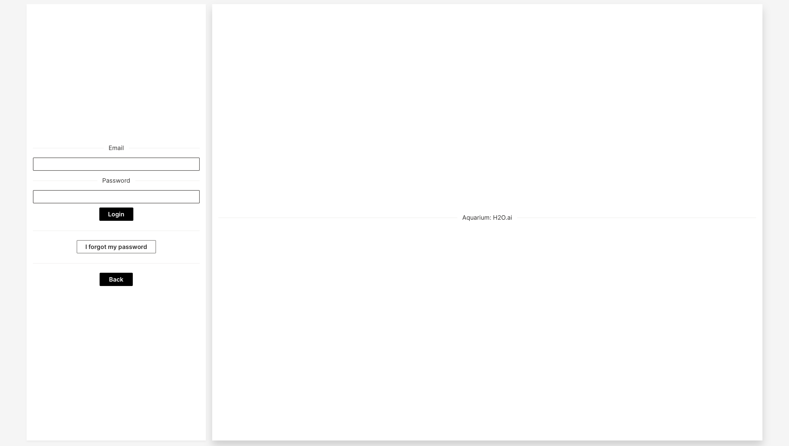
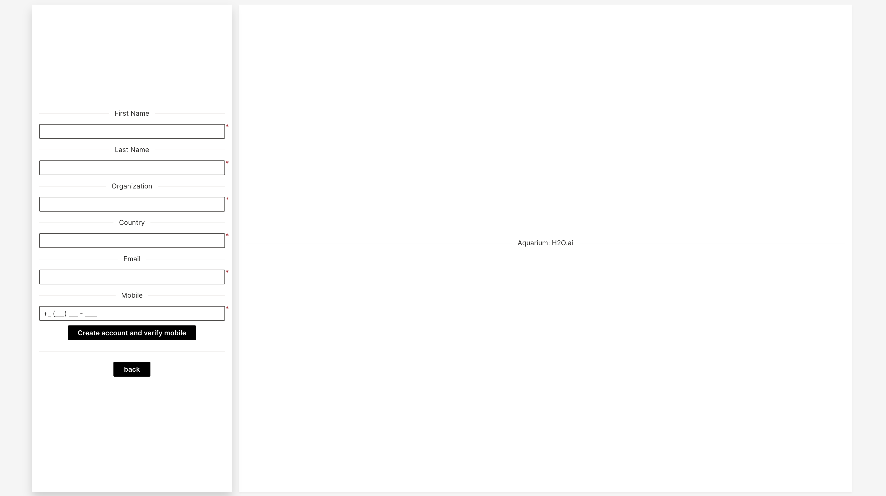

# NOTE: STILL UNDER REVIEW AND DEVELOPMENT

# Aquarium

A Wave app that replaces the current front-end of Aquarium: 

> An open-source framework for managing the hands-on laboratory learning experience for students.
Aquarium is a webapp that manages EC2 lab instances in your AWS account. It will spin up and spin down EC2 instances in a managed fashion. This will avoid leaving instances running indefinitely and racking up huge  charges.


# Setup

### Step 1: Download the H2O Wave SDK for your platform.

[Download the H2O Wave SDK](https://github.com/h2oai/wave/releases/latest) for your platform.

### Step 2: Extract

Extract your download.

```
tar -xzf wave-x.y.z-linux-amd64.tar.gz
```

### Step 3: Move

Move it to a convenient location, say $HOME/wave/.

```
 mv wave-x.y.z-linux-amd64 $HOME/wave
 ```
 
### Step 4: Run

Go to your Wave directory.

```
cd $HOME/wave
```

Start the Wave server.

```
./waved
```

```
2020/10/27 16:16:34 # 
2020/10/27 16:16:34 # ┌─────────────────────────┐
2020/10/27 16:16:34 # │  ┌    ┌ ┌──┐ ┌  ┌ ┌──┐  │ H2O Wave
2020/10/27 16:16:34 # │  │ ┌──┘ │──│ │  │ └┐    │ (version) (build)
2020/10/27 16:16:34 # │  └─┘    ┘  ┘ └──┘  └─┘  │ © 2020 H2O.ai, Inc.
2020/10/27 16:16:34 # └─────────────────────────┘
2020/10/27 16:16:34 # 
2020/10/27 16:16:34 # {"address":":10101","t":"listen","webroot":"/home/elp/wave/www"}
```

### Step 5: Verify

Finally, point your web browser to http://localhost:10101/. You should see an empty page with a blinker that says: Wave: Live. 


### Step 6: Run the Aquarium Wave app 

Rename your `aquarium_wave-master` (download) to `aquarium`. 

Move it to a convenient location, say $HOME/Aquarium/. First, create a folder name Aquarium in your home directory. Rigth after, in a new terminal: Create a virtual environment and install the Aquarium's dependencies.

```
cd $HOME/Aquarium
python3 -m venv venv
source venv/bin/activate
pip install -r requirements.txt
pip install requests
```

Finally, run Aquarium inside the Aquarium folder:

```
wave run Aquarium 
```

Go to http://localhost:10101/aquarium to access Aquarium.

# Views 

Landing Page: 




Create Account: 



Lab Instance: 


Dashboard: 


Neon Theme: 


